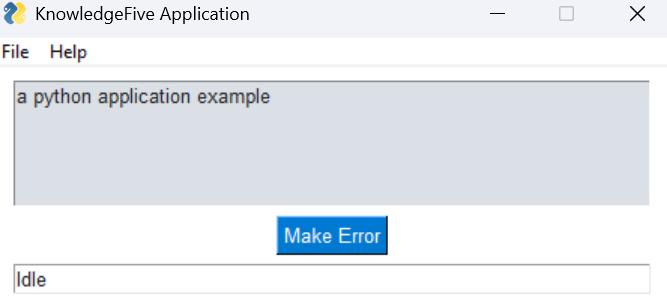

# about the project
<table>
    <tr>
        <th>Details</th>
        <th>Example</th>
    </tr>
    <tr>
        <td>an example application for learning to code</td>
        <td></td>
    </tr>
</table>

# built with
python

# replit
https://replit.com/@knowledgefive/app

# Getting Started
```
git clone https://github.com/knowledgefive/app.git
```

# roadmap
- to explore python

# Contact
https://linktr.ee/knowledgefive
