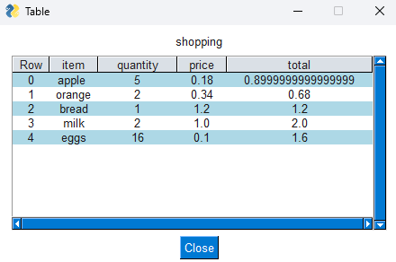

# Feature: Opening an excel worksheet into a simple table

<table>
    <tr>
        <th>Details</th>
        <th>Example</th>
    </tr>
    <tr>
        <td>Use the file menu and select 'Open Excel Worksheet'</td>
        <td></td>
    </tr>
    <tr>
        <td>Choose an excel workbook</td>
        <td></td>
    </tr>
    <tr>
        <td>Choose a worksheet from the workbook</td>
        <td></td>
    </tr>
    <tr>
        <td>The worksheet will load into simple table</td>
        <td></td>
    </tr>
</table>